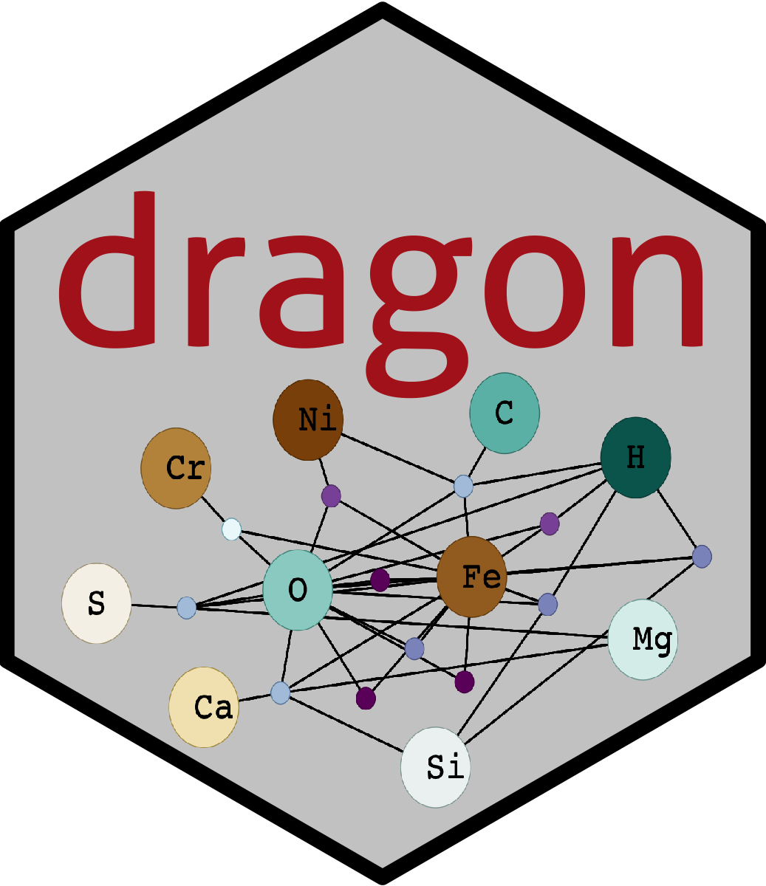
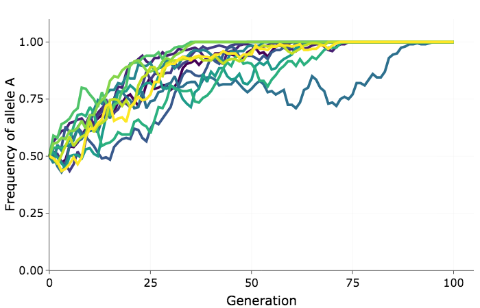

<br><br>


# Software

This page contains software packages I have written in R and Python.

<hr>

```{r, out.width="75px", echo=F}

```
[`pyvolve`](https://github.com/sjspielman/pyvolve), a Python package for simulating sequences using continuous-time Markov models over phylogenies 


<br>

```{r, out.width="75px", echo=F}

```
[`dragon`](https://github.com/sjspielman/dragon), an R package offering a Shiny App to explore mineral-chemistry networks in deep geologic time

<br>

```{r, out.width="75px", echo=F}

```
[`introverse`](https://github.com/spielmanlab/introverse), an in-development R package for introducing novices to R and the `tidyverse`


<br>

```{r, out.width="75px", echo=F}

```
[`evolfoRces`](https://github.com/spielmanlab/evolfoRces), a Shiny App for simple two-allele population genetics simulations in the classroom

